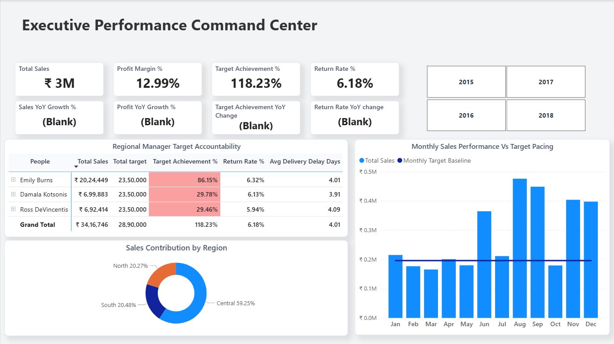
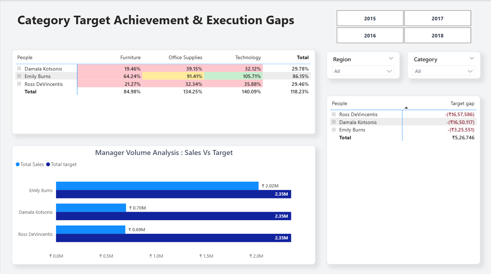
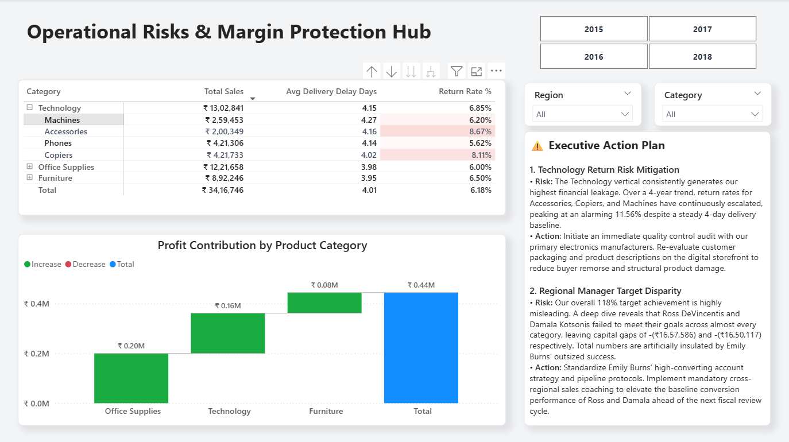

# Executive Performance & Margin Protection Hub
### Power BI · DAX · SQL · Star Schema

## Business Problem
A regional sales company's Sales Manager was unable to explain to leadership 
whether the business was growing, whether Regional Managers were hitting targets, 
and whether returns and delivery delays were creating risk. Reporting was manual, 
scattered, and confusing.

## Solution
A 3-page executive Power BI dashboard designed for a zero-analytics client — 
built to tell a clear business story, not just display numbers.

---

## Dashboard Pages

### Page 1 — Executive Performance Command Center

**What it shows:**
- Total Sales, Profit Margin %, Target Achievement %, Return Rate % — all with YoY comparison
- Regional Manager accountability table (Sales vs Target vs Return Rate vs Delivery Delay)
- Sales contribution by region (donut chart)
- Monthly sales vs target pacing (bar + line chart)

---

### Page 2 — Category Target Achievement & Execution Gaps

**What it shows:**
- Manager × Category matrix with color-coded achievement % (red/yellow/green)
- Key insight: Overall 118% achievement was misleading — 2 of 3 managers had ₹16.5L+ individual target gaps
- Manager Sales vs Target bar chart
- Target gap table ranked by shortfall

---

### Page 3 — Operational Risks & Margin Protection Hub

**What it shows:**
- Category-wise delivery delay and return rate breakdown
- Profit contribution waterfall chart by product category
- Executive Action Plan — plain business language recommendations for the Sales Manager

---

## Data Model
- **Schema:** Star Schema
- **Fact table:** Fact_Sales (transactions)
- **Dimensions:** Calendar, People, Target
- **Bridge key:** CategoryYearKey — enables accurate category-wise target allocation per Regional Manager

---

## Key DAX Measures Written
- `Total Sales`, `Total Profit`, `Profit Margin %`
- `Target Achievement %` — using CALCULATE + ALLSELECTED
- `Sales YoY Growth %`, `Profit YoY Growth %`
- `Return Rate %`, `Avg Delivery Delay Days`
- `Target Gap` (Sales minus Target)

---

## Key Insights Discovered
1. Overall 118% target achievement was inflated by one manager (Emily Burns). 
   Ross DeVincentis and Damala Kotsonis had gaps of ₹16.5L+ each.
2. Technology category had the highest return rate — Accessories peaked at 11.56%.
3. Copiers showed escalating return rates across all 4 years despite stable delivery times,
   indicating a product quality issue, not a logistics issue.

---

## SQL Validation
All DAX measure outputs were cross-validated using SQL queries on the source dataset —
verifying Total Sales, Return Rate %, and Target Achievement % figures before 
final dashboard delivery.

## Tools Used
| Tool | Purpose |
|------|---------|
| Power BI Desktop | Dashboard design and DAX measures |
| DAX | KPI calculations, YoY metrics, target tracking |
| SQL | Data validation and cross-checking |
| Star Schema | Data modelling |

---

## Files
- `Executive_Performance_Hub.pbix` — Power BI source file
- Dashboard screenshots (Pages 1–3)
